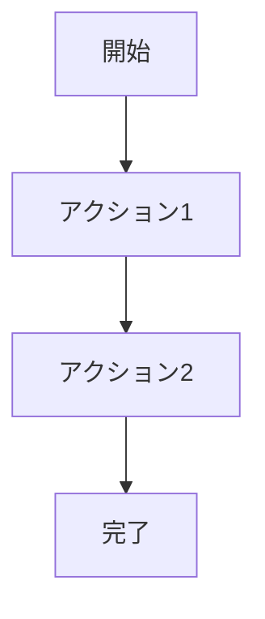

# {機能名}

## 画面構成

{この機能に関連するUIコンポーネントをリスト形式で記述}

- WidgetName: 説明

## データモデル

{この機能で使用するデータモデルを記述}

- ModelName: フィールド1, フィールド2, ...

## 状態管理

{この機能に関連するProvider/状態管理を記述}

- ProviderName: 役割の説明
- メソッド名: 処理の説明

## ユーザーフロー

{ユーザーがこの機能を使う際の操作手順をmermaid図または箇条書きで記述}

または箇条書き:

1. ステップ1
2. ステップ2
3. ステップ3

## 実装詳細

{主要なファイルパスとコードスニペットを記述}

### 関連ファイル

- `lib/path/to/file.dart`: ファイルの役割

### 主要なコード

必要に応じて重要なコード片を引用
