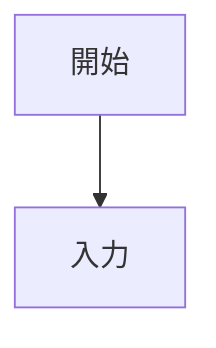

# Notion Markdown Uploader

## 概要

このスキルは、任意のマークダウンファイルをNotionページとして投稿します。マークダウンを解析してNotion-flavored Markdownに変換し、指定された親ページの直下にページを作成します。

## 使用タイミング

以下のような場合にこのスキルを使用してください:

- 「マークダウンをNotionに投稿して」
- 「このファイルをNotionにアップロードして」
- 「ドキュメントをNotionに追加して」
- 「〇〇.mdをNotionに上げて」

## ワークフロー

### 1. 設定ファイルの読み込み

まず、`.cursor/skills/notion-markdown-uploader/config.json` を読み込んで親ページIDを取得します。

```json
{
  "parent_page_id": "YOUR_NOTION_PAGE_ID_HERE"
}
```

**重要**: 初回実行時、`parent_page_id` が `"YOUR_NOTION_PAGE_ID_HERE"` のままの場合は、ユーザーに実際のNotion親ページIDを尋ね、config.jsonを更新してください。

### 2. マークダウンファイルの選択

ユーザーにアップロードしたいマークダウンファイルのパスを尋ねます。

**質問例**: 「Notionにアップロードするマークダウンファイルのパスを教えてください（例: docs/features/todo_add.md）」

### 3. マークダウンファイルの読み込み

指定されたパスのマークダウンファイルを読み込みます。ファイルが存在しない場合はエラーメッセージを表示してワークフローを終了します。

### 4. ページタイトルの生成

ファイル名から拡張子を除去してページタイトルを生成します。

**例**:
- `todo_add.md` → `todo_add`
- `feature-docs.md` → `feature-docs`

### 5. マークダウンの変換

`references/conversion.md` に記載された変換ルールに基づいて、標準マークダウンをNotion-flavored Markdownに変換します。

#### 主な変換ルール

以下の要素を変換します:

**そのまま使用可能な要素**:
- 見出し: `#`, `##`, `###`, `####`
- 太字: `**text**`
- イタリック: `*text*`
- インラインコード: `` `code` ``
- コードブロック: ` ```language\ncode\n``` `
- リンク: `[text](url)`
- 水平線: `---`
- 数式: `$inline$`, `$$\nblock\n$$`

**変換が必要な要素**:

1. **画像**:
   ```markdown
   
   ```
   ↓
   ```
   <image source="url">alt text</image>
   ```

2. **引用（複数行を1つの引用ブロックにまとめる）**:
   ```markdown
   > 行1
   > 行2
   ```
   ↓
   ```
   > 行1<br>行2
   ```

3. **テーブル**:
   ```markdown
   | Header1 | Header2 |
   |---------|---------|
   | Cell1   | Cell2   |
   ```
   ↓
   ```
   <table header-row="true">
   	<tr>
   		<td>Header1</td>
   		<td>Header2</td>
   	</tr>
   	<tr>
   		<td>Cell1</td>
   		<td>Cell2</td>
   	</tr>
   </table>
   ```

4. **リストのインデント（スペースをタブに変換）**:
   ```markdown
   - Item 1
     - Nested item
   ```
   ↓
   ```
   - Item 1
   	- Nested item
   ```

5. **空行の処理**:
   - 複数の連続した空行（3行以上）は `<empty-block/>` に変換

#### 変換実装のガイドライン

以下の順序で変換を実行してください:

1. **コードブロックの保護**: コードブロック内の内容は変換せず、そのまま保持
2. **画像の変換**: ``を`<image>`タグに変換
3. **引用の結合**: 連続する引用行を1つのブロックに統合し、`<br>`で連結
4. **テーブルの変換**: マークダウンテーブルをXML形式に変換
5. **インデントの変換**: リストや子要素のインデント（スペース2つまたは4つ）をタブ1つに変換
6. **エスケープ処理**: 必要に応じて特殊文字（`\ * ~ ` $ [ ] < > { } | ^`）をエスケープ
7. **空行の処理**: 3行以上の連続した空行を `<empty-block/>` に変換

### 6. Notionページの作成

Notion MCP の `notion-create-pages` ツールを使用してページを作成します。

**パラメータ**:
```json
{
  "parent": {
    "page_id": "<親ページID（config.jsonから取得）>"
  },
  "pages": [
    {
      "properties": {
        "title": "<ページタイトル（ファイル名から生成）>"
      },
      "content": "<変換済みNotion-flavored Markdown>"
    }
  ]
}
```

**MCP呼び出し例**:
```
CallMcpTool
  server: "user-Notion"
  toolName: "notion-create-pages"
  arguments: {上記のJSON}
```

### 7. 結果の通知

成功した場合:
- 作成されたページのURLを表示
- 「Notionページを作成しました: [ページタイトル]」
- ページURLを返却

失敗した場合:
- エラーメッセージを表示
- 失敗の原因を説明（ファイルが見つからない、Notion APIエラーなど）

### 8. 設定ファイルのクリーンアップ（重要）

**必須ステップ**: アップロード処理が完了したら（成功・失敗問わず）、必ず `config.json` の `parent_page_id` を `"YOUR_NOTION_PAGE_ID_HERE"` に戻してください。

これにより、個人のNotion IDがgitリポジトリにコミットされることを防ぎます。

```json
{
  "parent_page_id": "YOUR_NOTION_PAGE_ID_HERE"
}
```

**実装**:
```
StrReplace
  path: .cursor/skills/notion-markdown-uploader/config.json
  old_string: {
  "parent_page_id": "<実際のID>"
}
  new_string: {
  "parent_page_id": "YOUR_NOTION_PAGE_ID_HERE"
}
```

## エラーハンドリング

### 1. 設定ファイルのエラー

- `config.json` が存在しない場合: デフォルトの設定ファイルを作成し、ユーザーに親ページIDの入力を促す
- `parent_page_id` が未設定の場合: ユーザーに入力を促し、設定ファイルを更新

### 2. ファイルエラー

- マークダウンファイルが存在しない場合: 「ファイルが見つかりません: {パス}」と表示
- ファイルが空の場合: 「ファイルが空です」と警告し、空のページを作成するか確認

### 3. 変換エラー

- 複雑なマークダウン構文が変換できない場合: 可能な限り元の形式を保持してNotionに投稿
- サポートされていない要素（Mermaid図など）: コードブロックとして保持

### 4. Notion APIエラー

- 親ページが見つからない場合: 「指定された親ページが見つかりません。config.jsonのparent_page_idを確認してください」
- 権限エラー: 「Notionページへのアクセス権限がありません」
- ネットワークエラー: 「Notion APIへの接続に失敗しました」

## 使用例

### 例1: 基本的な使用

**ユーザー**: 「docs/features/todo_add.md をNotionにアップロードして」

**アシスタント**:
1. `config.json` を読み込み、親ページIDを取得
2. `docs/features/todo_add.md` を読み込み
3. マークダウンをNotion形式に変換
4. Notionページを作成（タイトル: "todo_add"）
5. 「Notionページを作成しました: todo_add」とページURLを表示

### 例2: 初回設定

**ユーザー**: 「README.mdをNotionにアップロードして」

**アシスタント**:
1. `config.json` を読み込み、`parent_page_id` が未設定と判明
2. 「Notion親ページのIDを教えてください。NotionページのURLから取得できます（例: https://notion.so/My-Page-abc123 の abc123 部分）」
3. ユーザーからIDを受け取る: "a1b2c3d4e5f6"
4. `config.json` を更新
5. `README.md` を読み込み、変換、アップロード
6. 成功メッセージとURLを表示

### 例3: 複雑なマークダウン

**マークダウン内容**:
```markdown
# TODO追加機能

## 画面構成

- **TodoInput**: テキスト入力フィールド

## ユーザーフロー



| 項目 | 説明 |
|------|------|
| ID   | 識別子 |


```

**変換後のNotion-flavored Markdown**:
```
# TODO追加機能

## 画面構成

- **TodoInput**: テキスト入力フィールド

## ユーザーフロー


<table header-row="true">
	<tr>
		<td>項目</td>
		<td>説明</td>
	</tr>
	<tr>
		<td>ID</td>
		<td>識別子</td>
	</tr>
</table>

<image source="https://example.com/image.png">スクリーンショット</image>
```

## リファレンス

### 必須ファイル

1. **config.json**: 親ページIDの設定
2. **references/conversion.md**: 詳細な変換ルール

### 関連MCPツール

- **notion-create-pages**: 新規ページ作成
- **notion-fetch**: ページ情報取得（デバッグ用）
- **notion-update-page**: ページ更新（将来的な機能拡張用）

## 制限事項

1. **アップロード数**: 1回の実行で1つのマークダウンファイルのみ
2. **Notion非対応要素**: Mermaid図、HTML、iframeなどはコードブロックとして保持
3. **画像**: 外部URLの画像のみサポート（ローカル画像は未対応）
4. **テーブルの複雑性**: 結合セルやネストされたテーブルは非対応

## 今後の拡張

- 複数ファイルの一括アップロード
- ローカル画像のアップロード対応
- カスタム変換ルールの設定
- ページ更新機能（既存ページの上書き）

## トラブルシューティング

### 「親ページが見つかりません」エラー

1. `config.json` の `parent_page_id` が正しいか確認
2. NotionページのURLから正しいIDを取得（ダッシュなしの32文字の英数字）
3. Notion MCPが該当ページへのアクセス権限を持っているか確認

### マークダウンの一部が正しく変換されない

1. `references/conversion.md` で該当要素の変換ルールを確認
2. サポートされていない構文の場合は、可能な限り近い形式で保持
3. 複雑な構文は手動でNotionで編集することを推奨

### ページが作成されない

1. Notion MCPが正しくセットアップされているか確認
2. ネットワーク接続を確認
3. Notion APIのレート制限に達していないか確認
