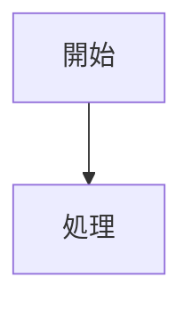

# マークダウン→Notion変換ルール

このドキュメントは、標準マークダウンをNotion-flavored Markdownに変換するための詳細なルールを定義します。

## 基本原則

1. **インデントはタブを使用**: Notionは子要素の表現にタブインデントを使用します
2. **空行の処理**: 複数の連続した空行は `<empty-block/>` に変換します
3. **エスケープ文字**: `\ * ~ ` $ [ ] < > { } | ^` はバックスラッシュでエスケープが必要です
4. **改行**: ブロック内の改行には `<br>` を使用します（特に引用ブロック内）

## 変換マッピング

### 見出し（Headings）

**標準マークダウン**:
```markdown
# 見出し1
## 見出し2
### 見出し3
#### 見出し4
```

**Notion形式**: そのまま使用可能
```
# 見出し1
## 見出し2
### 見出し3
#### 見出し4
```

**注意**: 見出し5と6はNotionでサポートされていないため、見出し4に変換されます。

### テキスト装飾（Rich Text）

| 標準マークダウン | Notion形式 |
|---|---|
| `**太字**` | `**太字**` |
| `*イタリック*` または `_イタリック_` | `*イタリック*` |
| `~~取り消し線~~` | `~~取り消し線~~` |
| `` `インラインコード` `` | `` `インラインコード` `` |
| `[リンクテキスト](URL)` | `[リンクテキスト](URL)` |

**下線**: 標準マークダウンにはないが、Notionでは以下の形式で表現:
```
<span underline="true">下線付きテキスト</span>
```

### リスト（Lists）

**箇条書きリスト**:

標準マークダウン:
```markdown
- アイテム1
- アイテム2
  - ネストされたアイテム
- アイテム3
```

Notion形式（タブでインデント）:
```
- アイテム1
- アイテム2
	- ネストされたアイテム
- アイテム3
```

**番号付きリスト**:

標準マークダウン:
```markdown
1. アイテム1
2. アイテム2
   1. ネストされたアイテム
3. アイテム3
```

Notion形式:
```
1. アイテム1
2. アイテム2
	1. ネストされたアイテム
3. アイテム3
```

**重要**: リストアイテムにはインラインテキストが必要です。空のリストアイテムは避けてください。

### コードブロック（Code Blocks）

**標準マークダウン**:
````markdown
```python
def hello():
    print("Hello, World!")
```
````

**Notion形式**: そのまま使用可能
````
```python
def hello():
    print("Hello, World!")
```
````

### 引用（Blockquotes）

**標準マークダウン**:
```markdown
> これは引用です
> 複数行の引用
```

**Notion形式**: 単一の `>` で複数行を `<br>` で連結
```
> これは引用です<br>複数行の引用
```

**注意**: 複数の `>` 行は複数の独立した引用ブロックとして扱われるため、1つの引用にまとめる場合は `<br>` を使用します。

### 画像（Images）

**標準マークダウン**:
```markdown

```

**Notion形式**: XML形式に変換
```
<image source="https://example.com/image.jpg">代替テキスト</image>
```

### テーブル（Tables）

**標準マークダウン**:
```markdown
| ヘッダー1 | ヘッダー2 |
|---------|---------|
| セル1   | セル2   |
| セル3   | セル4   |
```

**Notion形式**: XML形式に変換
```
<table header-row="true">
	<tr>
		<td>ヘッダー1</td>
		<td>ヘッダー2</td>
	</tr>
	<tr>
		<td>セル1</td>
		<td>セル2</td>
	</tr>
	<tr>
		<td>セル3</td>
		<td>セル4</td>
	</tr>
</table>
```

**注意**: 
- テーブル内のテキスト装飾はNotionマークダウンを使用（HTMLではない）
- `**太字**` は使用可、`<strong>` は使用不可

### 水平線（Horizontal Rules）

**標準マークダウン**:
```markdown
---
```

**Notion形式**: そのまま使用可能
```
---
```

### 数式（Math Equations）

**インライン数式**:

標準マークダウン: `$E=mc^2$`

Notion形式: `$E=mc^2$` （前後に空白が必要）

**ブロック数式**:

標準マークダウン:
```markdown
$$
E = mc^2
$$
```

Notion形式: そのまま使用可能
```
$$
E = mc^2
$$
```

### Mermaid図（Diagrams）

Notionは現在Mermaid図をネイティブサポートしていません。

**対応方法**: コードブロックとして保持
````markdown

````

## 特殊処理

### 空行の処理

**標準マークダウン**:
```markdown
段落1

段落2
```

**Notion形式**: 単一の空行はそのまま、複数の連続空行は `<empty-block/>` に変換
```
段落1
<empty-block/>
段落2
```

### エスケープ文字

以下の文字はバックスラッシュでエスケープする必要があります:
```
\ * ~ ` $ [ ] < > { } | ^
```

**例**:
- `\*` → アスタリスク（太字ではない）
- `\[` → 角括弧（リンクではない）

### ネストされたリスト

スペースではなく**タブ**を使用してネストを表現します:

```
- レベル1
	- レベル2
		- レベル3
```

### 子要素を持つブロック

Callout、Toggle、Columnsなどの子要素を持つブロックは、子要素を1タブインデントで配置します:

```
<callout icon="💡">
	これは注意書きです
	複数の子ブロックを含むことができます
</callout>
```

## 変換アルゴリズム

1. **行ごとに処理**: マークダウンファイルを1行ずつ読み込む
2. **ブロックタイプを識別**: 各行が属するブロックタイプを判定
3. **変換適用**: 該当する変換ルールを適用
4. **インデント処理**: ネストレベルに応じてタブを追加
5. **エスケープ処理**: 必要な文字をエスケープ
6. **結合**: 変換された行を結合してNotion形式のマークダウンを生成

## エッジケース

### 1. 空のリストアイテム

**避けるべき**:
```
- 
```

**推奨**:
```
- （空のアイテム）
```
または完全に削除

### 2. 複数の連続した引用

**標準マークダウン**:
```markdown
> 引用1
> 引用2
```

これは2つの独立した引用ブロックとして扱われます。1つにまとめる場合:

```
> 引用1<br>引用2
```

### 3. コードブロック内の特殊文字

コードブロック内では通常エスケープ不要ですが、バッククォート3つ (```) が含まれる場合は注意が必要です。

### 4. テーブル内の改行

テーブルセル内での改行は `<br>` を使用します:

```
<table>
	<tr>
		<td>行1<br>行2</td>
	</tr>
</table>
```

## 実装時の注意点

1. **順序処理**: コードブロック内の内容は変換せず、そのまま保持
2. **状態管理**: 現在どのブロックタイプを処理中かを追跡
3. **バッファリング**: 複数行にまたがるブロック（引用、テーブル）はバッファして一括変換
4. **検証**: 変換後のマークダウンがNotionの仕様に準拠しているか確認

## Notion MCPツール使用例

### ページ作成とコンテンツ追加

```
1. create-page ツールでページを作成
   - parent_page_id: 親ページID
   - title: ページタイトル
   
2. append-content ツールで変換済みコンテンツを追加
   - page_id: 作成したページのID
   - content: 変換済みNotion-flavored Markdown
```
