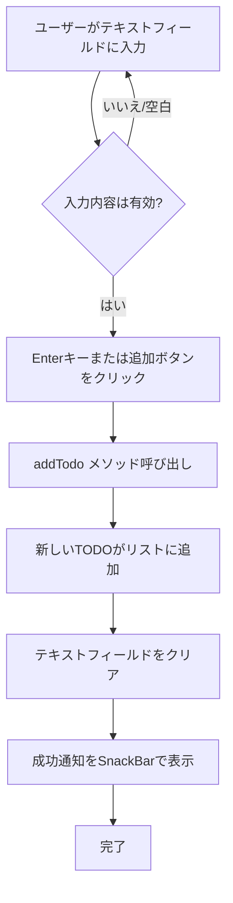

# TODO追加機能

## 画面構成

- **TodoInput**: テキスト入力フィールドと追加ボタンを含むWidget
  - TextFieldでタスク名を入力
  - IconButtonまたはEnterキーで追加実行
  - 追加後にSnackBarで通知

## データモデル

- **Todo**: TODOアイテムのデータモデル
  - `id`: String - 一意識別子
  - `title`: String - タスク名
  - `isCompleted`: bool - 完了状態（デフォルト: false）

## 状態管理

- **TodoPod**: TODOリストを管理するProvider
  - `addTodo(String title)`: 新しいTODOをリストに追加するメソッド
    - 空白のみのタイトルは無視
    - DateTime.now()でIDを生成
    - 状態を更新してリストに追加

## ユーザーフロー



## 実装詳細

### 関連ファイル

- `lib/widgets/todo_input.dart`: 入力UIコンポーネント
- `lib/providers/todo_provider.dart`: 状態管理（addTodoメソッド）
- `lib/models/todo.dart`: データモデル定義

### 主要なコード

**TodoInputウィジェット（lib/widgets/todo_input.dart）**

```dart
class TodoInput extends HookConsumerWidget {
  void submitTodo() {
    final title = controller.text.trim();
    if (title.isNotEmpty) {
      ref.read(todoPodProvider.notifier).addTodo(title);
      controller.clear();
      // SnackBar通知
    }
  }
}
```

**addTodoメソッド（lib/providers/todo_provider.dart）**

```dart
void addTodo(String title) {
  if (title.trim().isEmpty) return;
  
  final newTodo = Todo(id: DateTime.now().toString(), title: title);
  state = [...state, newTodo];
}
```
