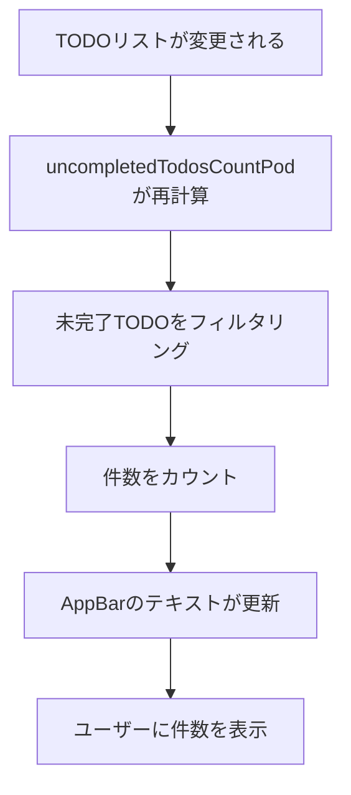

# 未完了件数表示機能

## 画面構成

- **TodoPage (AppBar)**: メイン画面のAppBar
  - `PreferredSize`ウィジェット内にテキスト表示
  - 「未完了: X件」形式で表示
  - リアルタイムに件数が更新される

## データモデル

- **Todo**: カウント対象のデータモデル
  - `isCompleted`: bool - カウント条件（false のみカウント）

## 状態管理

- **uncompletedTodosCountPod**: 未完了TODO件数を計算するProvider
  - `TodoPod`を監視
  - `isCompleted == false`のTODOをカウント
  - TODOリストが変更されると自動的に再計算

## ユーザーフロー



### 変更トリガー例

1. TODO追加 → 未完了件数 +1
2. TODO完了切り替え（未完了→完了） → 未完了件数 -1
3. TODO完了切り替え（完了→未完了） → 未完了件数 +1
4. TODO削除（未完了） → 未完了件数 -1
5. TODO削除（完了済み） → 未完了件数 変化なし

## 実装詳細

### 関連ファイル

- `lib/main.dart`: AppBar内での件数表示
- `lib/providers/todo_provider.dart`: 件数計算ロジック

### 主要なコード

**AppBarでの表示（lib/main.dart）**

```dart
class TodoPage extends ConsumerWidget {
  @override
  Widget build(BuildContext context, WidgetRef ref) {
    final uncompletedCount = ref.watch(uncompletedTodosCountPodProvider);
    
    return Scaffold(
      appBar: AppBar(
        title: const Text('TODOアプリ'),
        bottom: PreferredSize(
          preferredSize: const Size.fromHeight(48),
          child: Padding(
            padding: const EdgeInsets.only(bottom: 8),
            child: Text(
              '未完了: $uncompletedCount件',
              style: Theme.of(context).textTheme.titleMedium,
            ),
          ),
        ),
      ),
      // body...
    );
  }
}
```

**uncompletedTodosCountPod（lib/providers/todo_provider.dart）**

```dart
@riverpod
int uncompletedTodosCountPod(UncompletedTodosCountPodRef ref) {
  final todos = ref.watch(todoPodProvider);
  return todos.where((todo) => !todo.isCompleted).length;
}
```

### 動作の仕組み

1. `ref.watch(todoPodProvider)`でTODOリストを監視
2. TODOリストが変更されるたびに自動的に再計算
3. `where((todo) => !todo.isCompleted)`で未完了のみフィルタ
4. `.length`で件数を取得
5. UIが自動的に更新される（Riverpodのリアクティブシステム）
