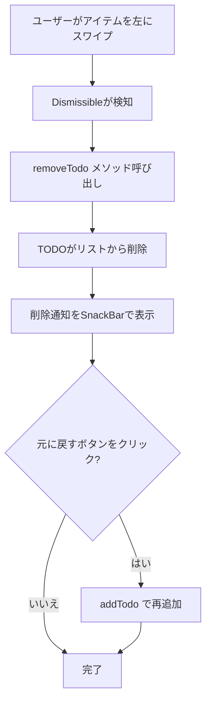
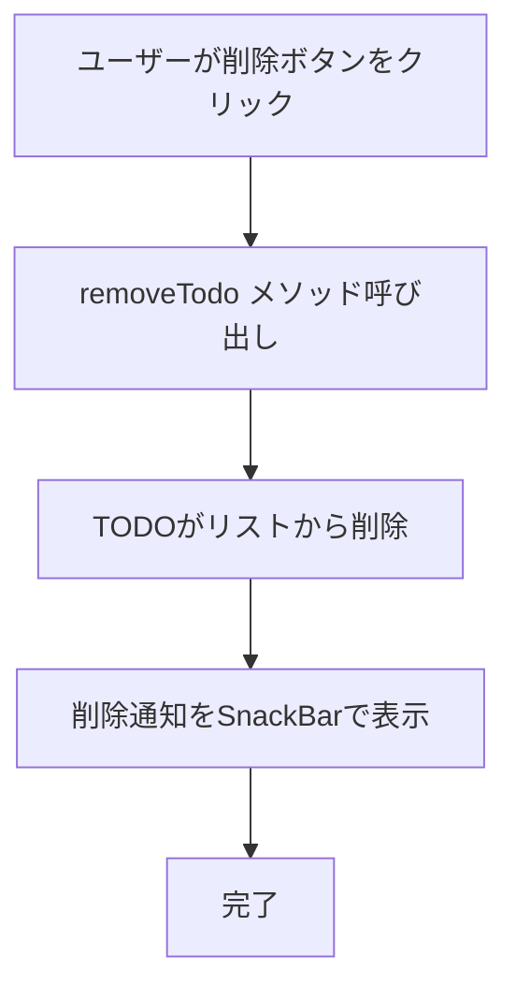

# TODO削除機能

## 画面構成

- **TodoListItem**: TODOアイテムを表示するWidget
  - Dismissible: スワイプで削除するジェスチャー
  - IconButton (trailing): 削除ボタン
  - 削除後にSnackBarで通知（元に戻す機能付き）

## データモデル

- **Todo**: TODOアイテムのデータモデル
  - `id`: String - 削除対象の識別子
  - `title`: String - 削除通知に使用

## 状態管理

- **TodoPod**: TODOリストを管理するProvider
  - `removeTodo(String id)`: 指定したTODOをリストから削除するメソッド
    - IDで対象のTODOをフィルタリング
    - 新しいリストで状態を更新

## ユーザーフロー

### スワイプで削除



### 削除ボタンで削除



## 実装詳細

### 関連ファイル

- `lib/widgets/todo_list_item.dart`: リストアイテムUIコンポーネント
- `lib/providers/todo_provider.dart`: 状態管理（removeTodoメソッド）

### 主要なコード

**Dismissible（スワイプ削除）（lib/widgets/todo_list_item.dart）**

```dart
Dismissible(
  key: ValueKey(todo.id),
  onDismissed: (_) {
    ref.read(todoPodProvider.notifier).removeTodo(todo.id);
    ScaffoldMessenger.of(context).showSnackBar(
      SnackBar(
        content: Text('「${todo.title}」を削除しました'),
        action: SnackBarAction(
          label: '元に戻す',
          onPressed: () {
            ref.read(todoPodProvider.notifier).addTodo(todo.title);
          },
        ),
      ),
    );
  },
  background: Container(
    color: Colors.red,
    // 削除アイコン表示
  ),
  child: // ListTile
)
```

**削除ボタン（lib/widgets/todo_list_item.dart）**

```dart
IconButton(
  icon: const Icon(Icons.delete),
  tooltip: '削除',
  onPressed: () {
    ref.read(todoPodProvider.notifier).removeTodo(todo.id);
    ScaffoldMessenger.of(context).showSnackBar(
      SnackBar(content: Text('「${todo.title}」を削除しました'))
    );
  },
)
```

**removeTodoメソッド（lib/providers/todo_provider.dart）**

```dart
void removeTodo(String id) {
  state = state.where((todo) => todo.id != id).toList();
}
```
