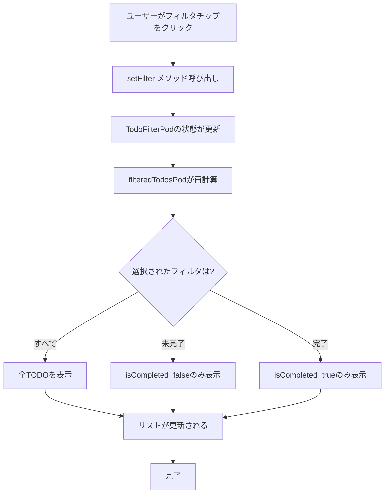

# フィルタリング機能

## 画面構成

- **TodoFilterChips**: フィルタ選択用のチップボタンを表示するWidget
  - FilterChip × 3（すべて/未完了/完了）
  - 現在選択中のフィルタをハイライト表示
  - クリックでフィルタを切り替え

## データモデル

- **TodoFilter (enum)**: フィルタの種類を定義
  - `all`: すべてのTODOを表示
  - `active`: 未完了のTODOのみ表示
  - `completed`: 完了済みのTODOのみ表示

- **Todo**: フィルタリング対象のデータモデル
  - `isCompleted`: bool - フィルタリング条件

## 状態管理

- **TodoFilterPod**: 現在のフィルタ状態を管理するProvider
  - 初期値: `TodoFilter.all`
  - `setFilter(TodoFilter filter)`: フィルタを変更するメソッド

- **filteredTodosPod**: フィルタ適用済みのTODOリストを提供するProvider
  - `TodoPod`と`TodoFilterPod`を監視
  - フィルタに応じてリストをフィルタリング
  - `all`: 全件返却
  - `active`: `isCompleted == false`のみ
  - `completed`: `isCompleted == true`のみ

## ユーザーフロー



## 実装詳細

### 関連ファイル

- `lib/widgets/todo_filter_chips.dart`: フィルタUIコンポーネント
- `lib/providers/todo_provider.dart`: 状態管理（フィルタロジック）

### 主要なコード

**TodoFilterChips（lib/widgets/todo_filter_chips.dart）**

```dart
class TodoFilterChips extends ConsumerWidget {
  @override
  Widget build(BuildContext context, WidgetRef ref) {
    final currentFilter = ref.watch(todoFilterPodProvider);
    
    return Row(
      children: [
        FilterChip(
          label: const Text('すべて'),
          selected: currentFilter == TodoFilter.all,
          onSelected: (_) {
            ref.read(todoFilterPodProvider.notifier)
                .setFilter(TodoFilter.all);
          },
        ),
        // 他のFilterChip...
      ],
    );
  }
}
```

**TodoFilterPod（lib/providers/todo_provider.dart）**

```dart
@riverpod
class TodoFilterPod extends _$TodoFilterPod {
  @override
  TodoFilter build() => TodoFilter.all;

  void setFilter(TodoFilter filter) {
    state = filter;
  }
}
```

**filteredTodosPod（lib/providers/todo_provider.dart）**

```dart
@riverpod
List<Todo> filteredTodosPod(FilteredTodosPodRef ref) {
  final filter = ref.watch(todoFilterPodProvider);
  final todos = ref.watch(todoPodProvider);

  switch (filter) {
    case TodoFilter.all:
      return todos;
    case TodoFilter.active:
      return todos.where((todo) => !todo.isCompleted).toList();
    case TodoFilter.completed:
      return todos.where((todo) => todo.isCompleted).toList();
  }
}
```
