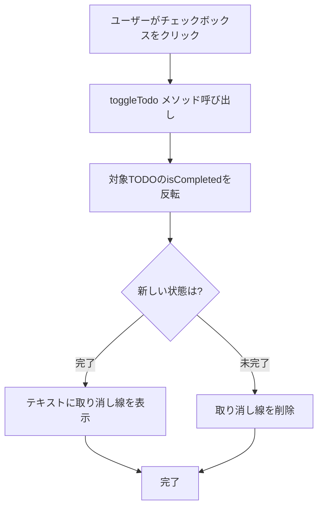

# TODO完了/未完了切り替え機能

## 画面構成

- **TodoListItem**: TODOアイテムを表示するWidget
  - Checkbox: 完了状態を表示・切り替え
  - チェックボックスクリックで状態変更
  - 完了時はテキストに取り消し線を表示

## データモデル

- **Todo**: TODOアイテムのデータモデル
  - `id`: String - 一意識別子
  - `title`: String - タスク名
  - `isCompleted`: bool - 完了状態

## 状態管理

- **TodoPod**: TODOリストを管理するProvider
  - `toggleTodo(String id)`: 指定したTODOの完了状態を反転するメソッド
    - IDで対象のTODOを検索
    - `copyWith`で`isCompleted`を反転
    - 新しい状態でリストを更新

## ユーザーフロー



## 実装詳細

### 関連ファイル

- `lib/widgets/todo_list_item.dart`: リストアイテムUIコンポーネント
- `lib/providers/todo_provider.dart`: 状態管理（toggleTodoメソッド）
- `lib/models/todo.dart`: データモデル定義

### 主要なコード

**TodoListItemのCheckbox（lib/widgets/todo_list_item.dart）**

```dart
Checkbox(
  value: todo.isCompleted,
  onChanged: (_) {
    ref.read(todoPodProvider.notifier).toggleTodo(todo.id);
  },
)
```

**toggleTodoメソッド（lib/providers/todo_provider.dart）**

```dart
void toggleTodo(String id) {
  state = [
    for (final todo in state)
      if (todo.id == id)
        todo.copyWith(isCompleted: !todo.isCompleted)
      else
        todo,
  ];
}
```

**スタイル切り替え（lib/widgets/todo_list_item.dart）**

```dart
Text(
  todo.title,
  style: TextStyle(
    decoration: todo.isCompleted
        ? TextDecoration.lineThrough
        : TextDecoration.none,
    color: todo.isCompleted ? Colors.grey : /* default */,
  ),
)
```
